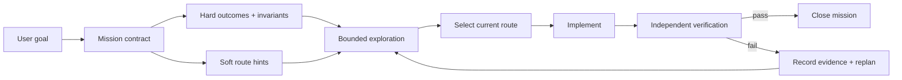

# Long Mission

> Version 1.0.10 — adds explicit user confirmation receipts, adaptive visual stopping, bilingual progress feedback, and failure-research evidence.

<div align="center">

**Long-running execution for AI agents — with freedom to explore and proof before completion.**

Outcome-driven mission control for complex tasks, PRD execution, UI work, migrations, debugging, and multi-phase delivery.


[](https://github.com/ccygod/long-mission/actions/workflows/tests.yml)

<a href="#quick-start">Quick start</a> ·
<a href="#how-it-works">How it works</a> ·
<a href="#why-not-just-another-plan">Why it is different</a> ·
<a href="#中文说明">中文说明</a>

</div>

**Chinese documentation:** [README-中文.md](README-中文.md)

## The problem

Long AI-agent tasks usually fail in one of two ways:

1. The agent follows the first plan too literally, even after evidence shows the route is wrong.
2. The agent explores freely but stops early, loses its context, or reports success without independent proof.

Long Mission is designed for the narrow space between those failures:

> **Lock the outcome. Keep the route open. Require evidence before completion.**

## What Long Mission is

Long Mission is a small, runtime-agnostic control protocol for durable agent work. It adds:

- a mission contract;
- a persistent state and progress ledger;
- an explicit exploration window;
- evidence-backed replanning;
- independent acceptance gates;
- real-user-surface and artifact-parity gates when needed;
- a bilingual final mission report;
- a completion receipt that cannot be granted by an ordinary “done” message;
- continuation and bounded runner support after context compaction or turn boundaries.
- an explicit user-confirmation receipt that cannot be replaced by editing `state.json`;
- adaptive visual stopping instead of a fixed ten-attempt rule;
- per-iteration bilingual feedback for every mission type, not only visual work;
- targeted WebSearch/official-source evidence after non-trivial failures before retry;
- `blocked_engine` and replan states for capability ceilings and repeated no-improvement attempts.

It is a control loop, not a promise that the host process will remain alive after a turn ends.

## The core idea: outcome contract, not an implementation rail



The mission contract separates four kinds of statements:

| Contract item | Default meaning |
| --- | --- |
| Outcome goal | What must be true for the user or product |
| Hard constraint | Safety, compatibility, data, API, authorization, and non-regression boundary |
| Soft implementation hint | A suggested framework, renderer, file layout, or sequence that may be replaced |
| Open decision | An ambiguity that needs a probe or focused user decision |

“Use framework X” is not automatically a hard constraint. It becomes one only when the PRD or user explicitly makes it binding, or when compatibility/safety depends on it.

## PRD mode and normal mode

Long Mission works in two modes.

### Normal mode

For a direct user request:

```text
goal → contract → acceptance → exploration → execution → verification → report → close
```

No PRD is required. The agent turns the request into a measurable outcome contract and asks only for missing decisions that materially change the result.

### PRD mode

When the user says “follow this PRD”, the mission creates `PRD-INTERPRETATION.md` and classifies the document into:

- outcome goals;
- hard constraints and invariants;
- soft implementation hints;
- open decisions.

The PRD remains the source of intended outcomes. Evidence remains the source of what actually works. If a proposed technical route fails, the agent may replan while preserving the approved outcome and hard constraints.

## Exploration without chaos

The agent receives a bounded exploration window. A probe is a small, falsifiable experiment against the hardest requirement:

```text
hypothesis → route attempted → independent evidence → measured result → decision
```

When a route fails, use the replan helper:

```bash
python3 scripts/mission_replan.py .long-mission/example \
  --superseded "DOM marker arrows" \
  --observed-failure "arrows not visible in real screenshot" \
  --new-route "custom SVG edge" \
  --preserve "topology" \
  --preserve "receipt counts" \
  --next-action "capture a settled browser screenshot"
```

Replanning is not disobedience. It is the protocol for replacing a falsified implementation hypothesis while keeping the real contract intact.

## Verification gates

The protocol uses only the gates that match the mission:

- **Standard acceptance:** declared commands, deliverables, and evidence;
- **Real user surface:** fresh supported host, settled UI, representative interaction, screenshot plus DOM/accessibility/event evidence;
- **Artifact parity:** source, build, and running service identify the same revision;
- **Receipt projection:** parent and child counters reflect their own receipts, not copied aggregates;
- **Process memory:** trajectory, episode/pattern derivation, applicability, delivery, and revalidation are independently visible;
- **Reference capability:** structure, topology, interaction, visual, evidence, responsive, and accessibility categories remain explicit.

`unknown`, `not observed`, and `not measured` are meaningful states. They must not be silently rendered as numeric zero or “passed”.

## Completion is a verified transition

An agent must not close a mission by writing `status=complete` in a JSON file or by saying “done”. The normal close path is:

```bash
python3 scripts/mission_report.py .long-mission/example
python3 scripts/mission_close.py .long-mission/example
```

`mission_close.py` runs the independent acceptance gate, requires the bilingual `MISSION-REPORT.md`, and writes a completion receipt only after the gate passes.

The final report contains:

- English first, Chinese second;
- objective and outcome;
- acceptance contract;
- exploration and replans;
- commands, tests, screenshots, and runtime evidence;
- failures, deviations, skipped checks, and unresolved items;
- artifacts and next actions.

## Why not just another plan?

Long Mission is deliberately smaller than a full multi-agent orchestration framework.

| Approach | Strong at | Long Mission adds or changes |
| --- | --- | --- |
| TDD/engineering skill packs | Test discipline and code workflow | Outcome/route separation and mission persistence |
| Spec-first planning | Roadmaps, active paths, scope changes | Real user surface, artifact parity, receipts, bilingual report |
| Persistent planning files | Keeping context across turns | Independent close gate and evidence authenticity |
| Full autonomous harnesses | Overnight execution and external graders | A lighter protocol that remains usable inside an ordinary agent turn |

It intentionally does not require subagents, worktrees, a specific framework, a particular provider, or a complex role graph for every task.

## Quick start

```bash
python3 scripts/mission_start.py .long-mission/my-task \
  --non-interactive \
  --objective "Deliver the requested feature" \
  --deliverable "src/feature.ts" \
  --acceptance "tests pass" \
  --scope "no publishing or destructive migration" \
  --limits "20 iterations"
```

`--non-interactive` leaves the mission awaiting confirmation. After the user explicitly confirms the displayed contract, record it with:

```bash
python3 scripts/mission_confirm.py .long-mission/my-task --phrase "确认执行"
```

For a PRD:

```bash
python3 scripts/mission_init.py .long-mission/my-prd \
  --objective "Implement the approved specification" \
  --prd docs/spec.md \
  --profile visual_ui \
  --deliverable src/feature.ts \
  --acceptance "real user surface passes"
```

Then read `MISSION.md`, complete `PRD-INTERPRETATION.md` if applicable, and keep `PROGRESS.md`, `state.json`, and `events.jsonl` current.

For bounded outer-loop execution:

```bash
python3 scripts/mission_runner.py .long-mission/my-task \
  --command "your-agent-command {prompt}"
```

## Tests

The repository includes protocol tests for:

- normal mode without a PRD;
- PRD interpretation mode;
- reference-profile gate stubs;
- route replanning;
- bilingual report requirement;
- stale completion rejection;
- runner rejection of fake completion.

```bash
python3 -m pytest -q tests test_long_mission_protocol.py
```

## Design boundaries

- A Skill can enforce a protocol; it cannot keep a host process alive after the host ends a turn.
- A completion gate proves the declared evidence, not the private chain-of-thought of an agent.
- The protocol is domain-agnostic. Project paths, engines, selectors, ports, providers, and thresholds belong in a mission adapter, not in `SKILL.md`.
- The repository intentionally does not force one language, UI framework, model provider, or deployment system.

## Credits and references

Long Mission is informed by practical work with Codex, Superpowers-style engineering workflows, spec-driven planning, persistent planning files, and long-running agent harnesses. It borrows ideas; it is not a copy of any one upstream project.

## 1.0.10 highlights

- **Visual/UI mission mode:** use `--profile visual_ui` for layout, spacing, topology, arrows, overlap, loading, and interaction work.
- **Real-surface proof:** Computer Use is preferred; a settled real-browser screenshot is the explicit fallback. Unit tests, DOM snapshots, or a stale tab cannot close a visual mission.
- **Adaptive visual loop:** no arbitrary ten-attempt completion rule; pass early, replan after consecutive no-improvement attempts, and retain a configurable safety cap.
- **Independent visual gate:** every attempt records verifier, settled state, representative interaction, screenshot evidence, and pass/fail status.
- **Universal iteration feedback:** every supervised iteration records result, evidence, next action, and bilingual progress feedback in `feedback.jsonl`, `events.jsonl`, and `PROGRESS.md`.
- **Failure research gate:** non-trivial or repeated failures require targeted WebSearch/official-source research and recorded URLs before retry or completion.

## 1.0.1 highlights

- Adds a PRD audit gate so unresolved `Partial` or `Blocked` rows cannot be silently presented as complete.
- Adds `scripts/runtime_truth.py` to verify the URL marker, listening PID, and actual process working directory. This catches stale ports, IPv4/IPv6 shadowing, and old supervised releases.
- Requires monitoring missions to verify both a positive receipt and a negative/no-call fixture, with loading and unknown states kept distinct from numeric zero.
- Expands protocol coverage to 31 tests.

## License

No license has been declared yet. Add a license before distributing this repository for third-party reuse.
